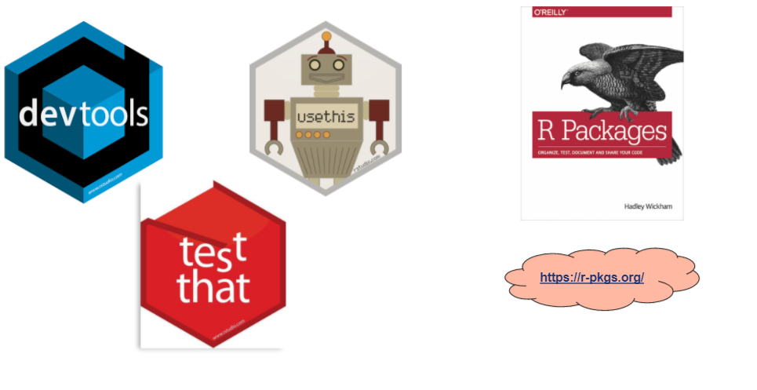

## Outline

- About me

- What is a package

- Why develop a package?

- Components of a package

- Package development in two steps

- What are we going to learn today?

- System requirements

- Background knowledge required?

- Demo/Hands-on

- Q&A


---

## About me

.right-column[

- A Public Health Physician

- A quality improvement professional and patient safety expert - led me to data science

- I am currently the Team Lead, Epidemiology and Surveillance Unit for the CARITAS Nigeria 4GATES program

- Author, [{tidyndr}](https://CRAN.R-project.org/package=tidyndr)

- Co-founder: [r4hds](https://r4hds.netlify.app/)

- [My personal website](https://taiye.rbind.io) `r emo::ji("smile")`

- Twitter `r icons::fontawesome("twitter")`: follow @eppydoc `r emo::ji("thumbsup")`
]

.left-column[
```{r, stephen, echo=FALSE}
knitr::include_graphics("./images/Stephen.png")
```
]

---

## What is a package?

- A collection of related functions
  
    - {tibble, readr, purrr}

- A collection of datasets

    - {gapminder, COVID19, rKenyaCensus}

- A mix of both [functions and dataset(s)]

    - {tidyndr, dplyr, tidyr}


---

## Why develop a package?
- Because you have a group of reusable codes

    - saves time
    
    - makes your code available to others, easily
    
    - validates your codes

> "Anything that can be automated, should be automated.
    Do as little as possible by hand.
    Do as much as possible with functions.
    The goal is to spend your time thinking about what you want your package to do rather than thinking about the minutiae of package structure."
> 
> --- ([R Packages](https://r-pkgs.org/intro.html))


---

## Components of a package
1. R codes

2. Documentations

3. Package metadata - DESCRIPTION file

4. License/Licensing

5. A Readme.md

4. Unit tests

6. Vignettes

7. Data

---

## Package development in two steps
.pull-left[
```{r, dev-image, echo=FALSE}

```

**Build your package (locally)**

]

.pull-right[
```{r, git-github, echo=FALSE}
knitr::include_graphics("./images/git_github.png")
```

**Deploy your package to a remote repository**
]

---

## What are we going to learn today?
- Building package 

    1. A little about functions in packages: how it is different from standard functions in scripts
    
    2. Documenting our R functions
    
    3. Function testing
    
    4. Editing package metadata - DESCRIPTION file
    
    5. Writing the "Readme" file
    
    6. Package vignette
    
- Package deployment

    1. Deploying to GitHub
    
    2. Steps to CRAN deployment
    
---

## Requirements
.pull-left[

- **System requirements**

    1. [R](https://cran.r-project.org/) (I am using version 4.1.1)
    
    2. [Git](https://git-scm.com/downloads) / [GitHub](https://github.com/)
    
    1. [RStudio](https://www.rstudio.com/products/rstudio/download/)
    
    4. Compiler: [Rtools](https://cran.r-project.org/bin/windows/Rtools/) on *Windows* / Xcode command line tools on [*macOS*](https://developer.apple.com/programs/register/)
        
]

.pull-right[

- **Package requirements**

    1. {devtools} - a metapackage of 9 focused packages
    
    2. {knitr} - comes with RStudio
    
    3. {available}
    
]


> "Check that your system set up is complete using the code below in R:""

```{r, eval=FALSE}
if(!requirenamespace("pacman") install.packages("pacman"))
pacman::p_load(devtools, available) ## p_load auto-installs packages that are not pre-installed on your computer
has_devel() ## checks that your system has all the required setup to build a package
```

---

## Background knowledge

1. Basic knowledge of functions

2. Some knowledge of Markdown/RMarkdown

3. Minimal understanding of git/GitHub

---
class: inverse, middle, center
background-image: url(https://upload.wikimedia.org/wikipedia/commons/3/39/Naruto_Shiki_Fujin.svg)
background-size: contain

# Demo
